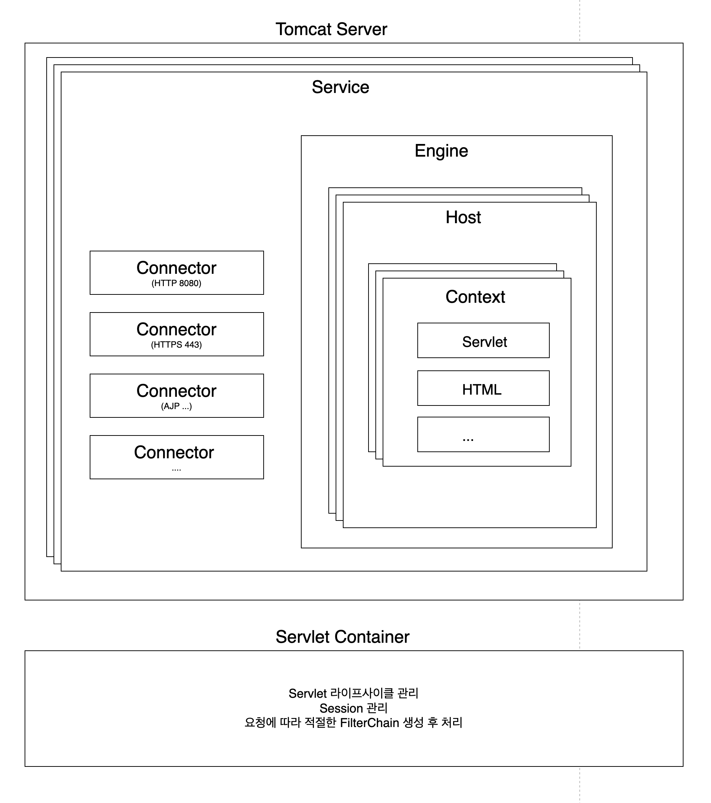

## Apache와 Tomcat의 관계

> 오픈소스 소프트웨어 재단인 Apache Software Foundation(ASF)에 의해 개발된 프로젝트 중 하나가 Apache 웹 서버이다. ASF는 비영리 조직으로, 수많은 프로젝트를 호스팅하고 있다. 
> ASF는 `Apache`라는 이름을 가진 모든 프로젝트를 관리하며, 각 프로젝트는 독립적으로 운영 및 개발된다. 
> Apache Tomcat은 ASF의 프로젝트중 하나로 Java Servlet과 JSP를 실행하기 위한 오픈소스 서블릿 컨테이너이다. 
> 원래 Tomcat은 Sun Microsystems(현재 Oracle)이 Java Servlet과 JSP를 구현하기 위해 개발한 프로젝트였지만, 이후 기증되어 현재까지 ASF에서 유지 및 관리하고 있다. 

## Apache HTTP Server와 Apache Tomcat의 관계
1. Apache HTTP Server
	1. 웹 서버 소프트웨어로, 정적 콘텐츠를 제공하는데 사용된다. 세계에서 가장 널리 사용되는 웹서버 중 하나로, HTTP 및 HTTPS 프로토콜을 통해 클라이언트의 요청을 처리한다.
2. Apache Tomcat
	1. **서블릿 컨테이너** 또는 웹 애플리케이션 서버로서, Java 서블릿과 JSP를 실행하고 관리한다. Tomcat은 Java 기반의 웹 애플리케이션을 처리하는데 사용되며, Java EE 웹 애플리케이션의 개발, 테스트, 배포환경으로 많이 사용된다.

> Apache HTTP Server와 Apaceh Tomcat은 종종 통합하여 사용된다. 예를 들어, Apache HTTP Server는 정적 컨텐츠를 처리하고 Tomcat은 동적 컨텐츠(Java Servlet, JSP)를 처리하도록 설정할 수 있다.
> 통합하려면 AJP 또는 Http Reverse Proxy를 사용하여 이루어진다. Apache HTTP Server는 클라이언트 요청을 적절한 Tomcat 인스턴스로 전달할 수 있다.


> [!info] Apache Tomcat만 사용하는 경우
> 1. 단순한 Java 웹 애플리케이션인 경우
> 2. 개발 및 테스트환경
> 3. 소규모 또는 내부 애플리케이션


## Tomcat의 역할
1. 커넥터를 활용하여 HTTP 요청을 수신하여 요청에 대한 세부정보 분석: 자체적으로 Http 커넥터를 내장하고 있어 클라이언트의 HTTP 요청을 직접 받을 수 있다. HTTP 요청을 수신하여 서블릿 또는 JSP와 같은 동적 웹 콘텐츠를 처리한다.
2. 서블릿 컨테이너의 역할: Tomcat은 서블릿 컨테이너로서, Java 서블릿과 JSP 파일을 실행하는 기능을 갖추고 있다. HTTP 요청이 들어오면, Tomcat은 해당 요청을 `HttpServletRequest` 객체로 파싱하고, 이를 서블릿에 전달하여 비즈니스 로직을 처리한다.
3. 웹 애플리케이션 배포 및 실행: Tomcat은 `.war` 파일 형태로 패키징된 Java 웹 애플리케이션을 배포하고 실행할 수 있다. 


## Tomcat의 구조



### (1) Server
> Tomcat의 최상위 구성요소로, 전체 서버를 나타낸다. 하나의 Tomcat 인스턴스에는 하나의 Server 객체가 있으며, 이 Server는 여러 **Service** 객체를 포함할 수 있다.
> Server는 Tomcat의 시작과 종료를 제어하며, 전체 서버의 생명주기를 관리한다.

### (2) Service
> Server 내 중간 구성요소로, 하나 이상의 **Connector**를 하나의 **Engine**에 연결한다. Service는 클라리언트로부터 요청을 받고 이를 처리할 적절한 엔진으로 전달하는 역할을 한다. 각 Service는 여러 Connector를 가질 수 있지만, 단 하나의 Engine과 연결된다.

> [!info] Service가 여러개로 나누어지는 경우
> - 독립적인 구성 필요 
> 	- 만약 프로토콜이나 포트가 다른 보안설정, 로깅설정, 또는 다른 네트워크 설정을 필요로 하는 경우
> 	- 단일 Tomcat 인스턴스에서 여러 애플리케이션 환경을 분리하여 사용해야할 때도 여러개의 service를 사용할 수 있다. 예를 들어 하나의 서비스를 개발환경으로하고 하나의 서비스를 운영환경으로 하고 싶다면 분리할 수 있다.
> - 다른 엔진 설정: 만약 각 Service가 다른 엔진 설정을 필요로 하는 경우 (예: 서로 다른 웹 애플리케이션을 완전히 독립적으로 구동해야하는 경우)

> [!info] Tomcat에 요청이 들어왔을 경우 Connector 연결과정
> 1. 클라이언트가 HTTP 요청을 보내면, Tomcat 서버는 모든 Connector는 자신이 리스닝하고 있는 포트를 통해 들어오는 요청을 수신한다. 
> 2. 각 Connector는 자신이 처리할 수 있는 요청의 종류(프로토콜)과 포트를 정의하고 있다. 예를 들어, 하나의 Service에 HTTP와 HTTPS Connector가 모두 설정되어있는 경우, 각 Connector는 자신이 처리할 수 있는 프로토콜과 포트에 맞는 요청만 수신한다.
> 3. Connector가 포함되어 있는 Service의 Engine으로 요청 전달한다.

### (3) Connector
> 클라이언트와의 통신을 처리하는 구성요소이다.
> - **HTTP Connector**: HTTP or HTTPS 프로토콜을 통해 들어오는 요청을 수신하며, 주로 Tomcat이 독립적으로 웹 애플리케이션을 제공할 때 사용된다.
> - **AJP Connector**: Apache HTTP Server와 같은 다른 웹 서버와의 통합을 위해 사용된다. Apache HTTP Server에서 들어오는 요청을 AJP 프로토콜을 통해 Tomcat으로 전달할 수 있다.

> [!note] 
> Tomcat 내 Service가 여러 개로 나누어져 있고, 독립적으로 거성이 가능하지만 port와 protocol은 중복없이 유니크해야한다. 

### (4) Engine
> Tomcat의 요청 처리 파이프라인을 담당하는 구성요소로, Service 내에 존재한다. 
> Engine은 여러 **Host**를 포함할 수 있으며, 각 요청을 적절한 Host로 전달하고, 요청을 처리한 후 응답을 다시 Connector로 보낸다.

> [!tip] 여러개의 호스트중에 어떤 식으로 선택되는지
> Tomcat은 Host 헤더가 일치하는 Host로 요청을 전달한다. 
> > [!example]
> > ```xml
> > `<Engine name="Catalina" defaultHost="www.example.com">
> > 	`<Host name="www.example.com" appBase"webapps1">
> > 		`<Context path="" docBase="ROOT" reloadable="true" />
> > 		`<Context path="/shop" docBase="shop" reloadable="true" />
> > 	`</Host>
> > `</Engine>
> > ```
> > `http://www.example.com/shop`로 요청이 오면 `www.example.com`을 가진 Host로 요청을 전달한다. 그리고 요청의 URL 경로가 `/shop`이므로, `/shop`으로 매핑된 Context에서 처리된다.

> [!tip] 여러 호스트를 하나의 IP에서 처리하는 이유
> 같은 브랜드에서 여러 서비스를 나누고 싶을 수도 있다. 예를 들어 `exmaple`이라는 브랜드라면 `shop.example.com`, `support.example.com`, `blog.example.com`이라는 서비스를 나누어놓고, 같은 서버자원을 사용하여 비용을 절감하고 싶다면 사용할 수 있을 것 같다. 

### (5) Host
> 특정 도메인 네임(EX: `www.example.com`)과 연관된 가상 호스트를 나타내며, 하나의 Engine 내에서 여러 Host를 정의할 수 있다. 각 Host는 하나이상의 **Context**를 포함할 수 있다.

> [!question] 요청기반으로 분기처리되는 것 같은데 왜 Connector가 아닌 Engine에 포함될까? 
> 우선 Connector는 네트워크 계층에서 작업을 처리한다. 
> Engine은 하나의 Service 내에서 요청의 라우팅을 관리하는 역할을 한다. Connector가 요청을 Service에 전달하면, Engine은 도메인 이름 기반의 호스팅 설정을 통해 적절한 Host를 선택하고, 각 Host의 Context 설정에 따라 Context 설정에 따라 최종적으로 요청을 라우팅한다. 
> 즉, 요청을 프로토콜과 포트에 따라 리스닝하고 있는 역할을 Connector가 하고, 받아서 전달할 때 어느 애플리케이션에 라우팅할지 선택하는 건 Engine이 한다. 그렇게 함으로써 웹서버가 여러 도메인을 손쉽게 관리할 수 있다.

### (6) Context
> 특정 웹 애플리케이션을 나타내는 구성요소이다. 각 Host는 여러 Context를 가질 수 있으며, Context는 웹 애플리케이션의 루트와 경로를 정의한다.
> Context는 서블릿, JSP, 정적파일, 웹 애플리케이션 설정 등을 포함하며, 각 애플리케이션이 독립적으로 동작하도록 관리한다.


> [!info] 주요설정 요소
> > [!example]
> > ```xml 
> > `<Context path="/shop" docBase="shop" reloadable="true">
> > ```
> - path: Context가 제공하는 웹 애플리케이션 URL 경로 정의. 따라서 예에서 설정으로 보았을때 `/shop` 경로로 들어오는 모든 요청을 처리하는 애플리케이션을 의미한다.
> - docBase: 웹 애플리케이션의 실제 위치를 지정한다. 이는 애플리케이션의 루트 디렉토리를 가리키며 docBase가 설정된 디렉토리 내의 모든 파일이 해당 웹 애플리케이션의 일부로 간주된다.
> - reloadable: 속성이 `true`로 설정된 경우, Tomcat 애플리케이션의 클래스 팡리이나 리소스 파일의 변경을 감지하고 자동으로 애플리케이션을 다시 로드할 수 있다.

### (7) Servlet Container (Catalina)
> Tomcat의 핵심 부분으로, Java 서블릿과 JSP를 실행하고 관리하는 역할을 한다. Catalina는 서블릿 스펙을 구현하며, 모든 HTTP 요청을 서블릿으로 매핑하여 처리한다.
> 서블릿 컨테이너는 서블릿의 수명 주기 관리(초기화, 서비스, 종료)를 담당하고, 동적 웹 컨텐츠를 생성하여 클라이언트에 반환한다.


> [!info] Servlet Container와 Context 관계
> - Servlet Container는 전체 Tomcat 서버에서 공유되는 요소이다. 즉, 모든 Context가 같은 Servlet Container를 사용하여 서블릿을 실행하고 관리한다. 


### A) Servlet
> 한마디로 웹에서 동적처리하여 요청/응답을 해주는 Java 기반의 서버측 구성요소다. 

#### Servlet을 사용하는 이유
- 서블릿은 HTTP 요청과 응답을 처리하기 위해 표준화된 API를 제공한다. 이 API는 요청 파라미터를 읽고, 세션을 관리하며, HTTP 응답을 생성하는데 필요한 모든 기능을 표현한다. 그래서 서블릿을 사용하면 요청 수신과 응답 생성하는 작업을 간소화하여 개발자의 작업을 줄여준다. 
- 서블릿 컨테이너를 통해 보안, 세션관리, 스레드 관리를 할 수 있다. 
- 서블릿 컨테이너를 통해 요청마다 새인스턴스를 생성하는 대신 단일 인스턴스를 재사용하여 자원을 절약한다. 
- 서블릿은 비즈니스 로직을 캡슐화하여 유지보수하기 쉽게 한다. 


> [!todo] 
> - init(), service(), destroy() 이 어떤 일을 하는지

### B) Servlet Container 로딩 시점
- `web.xml`, `@WebSocket` 기반 설정을 참조하여 어떤 서블릿이 웹 애플리케이션에서 사용되는지 확인한다. 
- 사용자가 지정한 서블릿 클래스를 메모리에 로드한다. 이때 컨테이너는 서블릿의 클래스 파일을 찾고, 클래스 로더를 통해 해당 클래스를 메모리에 로드한다.
- 서블릿 컨테이너는 로드된 서블릿 클래스의 인스턴스를 하나 생성한다. 이 인스턴스는 서블릿 컨테이너가 요청을 처리하는동안 재사용된다.
- 서블릿의 `init()` 메서드를 호출하여 초기화 작업을 수행한다. 이 메서드는 서블릿이 초기화될 때 한번만 호출되며, 필요한 자원 설정이나 준비 작업을 수행한다. 


### C) Servlet Container에 Request가 들어왔을 때 
- 클라이언트가 HTTP 요청을 보내면, Connector가 해당 요청을 수신한다. 
	- 이 단계에서 요청은 네트워크 인터페이스를 통해 들어오며, Tomcat은 Connector를 수신하게 된다. 기본적으로 Coyote HTTP Connector를 사용하여 이러한 HTTP 요청을 처리한다.
	- Tomcat은 스레드 풀에서 사용가능한 스레드를 찾는다. 사용가능한 스레드가 있으면 그 스레드가 해당 요청을 처리하기 위해 할당된다. (**사용가능한 스레드가 없고, 주어진 스레드로 사용해야하면 여기서 기다리는 건가?**)
	- 할당된 스레드는 요청을 처리하기 위해 Tomcat의 Request, Response 객체를 생성하고 이를 서블릿 컨테이너로 전달한다. 
- 서블릿 컨테이너는 요청을 수신하여 요청이 포함된 URL 패턴을 확인하여 적절한 서블릿으로 라우팅한다. (**서블릿 객체를 찾는 과정?**)
	- `web.xml` 파일이나 애노테이션 기반 설정에 따라 서블릿 컨테이너는 URL 패턴과 일치하는 서블릿을 찾는다. 요청된 URL 패턴과 서블릿이 매핑되면, 해당 서블릿의 `service()`메서드가 호출된다.
- 서블릿이 요청을 처리한 후, HTTP 응답을 생성하고 `HttpServletResponse` 객체를 통해 클라이언트에게 응답을 전송한다. 
	- 서블릿 컨테이너는 생성된 응답을 브라우저 또는 요청한 엔티티에 반환한다.


> [!info] 스레드 할당 시 사용가능한 스레드가 없다면? 스레드풀이 가득찼을 경우
> Connector가 요청을 수신하고, 요청을 처리할 스레드를 할당하려고 할 때, 스레드 풀에 사용가능한 스레드가 없을 경우 아래와 같은 정책에 따라 관리한다.
> 
> 1. 요청 대기 
> 	- 스레드 풀이 꽉 찬경우 Tomcat은 요청 대기열(Request Queue)에 넣는다. 이 대기열은 요청이 처리될 때마다 요청을 임시로 보관한다. Tomcat은 `server.xml` 파일의 Connector 설정에서 `acceptCount` 속성을 사용하여 대기열의 최대 길이를 지정할 수 있다.
> 	> [!example] 
> 	> ``` 
> 	> Connector
> 	> maxThread = "200"
> 	> acceptCount="100"
> 	> ```
> 	- 요청이 대기열에 들어가면 스레드가 사용 가능해질 때까지 기다린다. 사용 가능한 스레드가 생기면 대기열에서 가장 오래 기다린 요청이 스레드에 할당되어 처리된다.
> 2. 연결 거부 
> 	- 대기열(`acceptCount`)도 가득차있는 경우, Tomcat은 새로운 요청을 받을 수 없으므로 클라이언트의 연결을 거부하고 Connection Refused 오류를 반환한다. 이는 HTTP 상태코드 503(Service Unavaliable)로 표현될 수 있다.
> 3. 연결 시간 초과 
> 	- 클라이언트가 대기열에 있는 동안, 서버가 요청을 처리할 수 없는 시간이 지나면, 연결 시간 초과된다. 이 시간은 ConnectionTimeout 속성으로 설정할 수 있으며, 클라이언트는 서버로부터 응답이 오지 않으면 연결을 끊는다.
> 
> **해결방안**
> - 스레드 풀 크기 조정: `maxThreads` 값을 증가시켜 동시에 처리할 수 있는 요청의 수를 늘릴 수 있다. 하지만 서버의 하드웨어 리소스(메모리 및 CPU)에 맞춰 신중하게 설정해야한다. 
> - 대기열 크기 조정: `acceptCount`값을 늘려 대기할 수 있는 요청의 수를 늘릴 수 있다. 그러나 지나치게 큰 값을 설정하면 대기시간이 길어져 클라이언트 경험이 나빠질 수 있다.
> - 비동기 요청 처리: 비동기 처리하면 블로킹없이 긴 작업을 수행하고, 스레드를 효율적으로 사용할 수 있다.


> [!summary]
> Connector에서 Http 요청이 들어올때 생성되며, Service -> Engine -> Host -> Servlet Container -> Servlet 순으로 선달된다.(**맞는지 멘토님한테 확인해보기**)

### D) 세션 관리
- 서블릿 컨테이너는 사용자가 애플리케이션을 탐색하는동안 사용자와의 세션을 유지한다. 이를 위해 `HttpSession` 객체를 생성하고, 세션 ID나 쿠키나 URL 재작성 방식으로 클라이언트에 전달한다. 
- 사용자의 세션이 유효한 동안, 서블릿 컨테이너는 세션 데이터를 유지하며, 세션 타임아웃이나 사용자가 명시적으로 로그아웃할 때까지 세션을 관리한다. 


### E) 스레드 관리
- 서블릿 컨테이너는 각 HTTP 요청마다 별도의 스레드를 생성하거나 스레드 풀에서 사용가능한 스레드를 할당하여 요청을 처리한다. 서버자원의 효율적인 사용을 위해 최대 스레드 수를 관리하며, 필요에 따라 스레드를 생성하거나 제거한다. 


### F) 보안관리
- 서블릿 컨테이너는 보안설정을 적용하여 사용자 인증과 권한 부여를 수행한다. 
- `web.xml` 파일에서 정의된 보안 제약조건을 적용하거나 SSL/TLS 암호화를 통해 클라이언트와 서버간의 안전한 통신을 보장한다. 


### FilterChain
> Filter는 서블릿 요청을 전처리하거나 응답을 후처리하는데 사용된다. 여러 필터가 존재하는 경우 체인형태로 연결되어 요청과 응답을 처리한다. 

#### 생성
> 서블릿 컨테이너가 시작될 때 필터가 로드되면서 모든 필터가 초기화될 때, 각 필터는 요청 URL 패턴에 따라 특정에 따라 동작하도록 설정된다. 
> 
> 클라이언트에 HTTP 요청이 들어오면, 서블릿 컨테이너는 요청 URL에 대해 매핑된 필터들을 확인한다. 요청에 적용할 필터가 여러개 있을 경우, 필터체인이 자동으로 생성된다. 

#### 동작 방식
1. 클라이언트 요청 (HTTP 요청을 수신하면, 해당 요청이 처리될 URL에 매핑된 필터들이 확인된다.)
2. 필터체인 호출 (필터체인은 등록된 필터들을 순차적으로 실행된다.(web.xml에서는 나열된 순서, Spring Boot에서는 `@Order`의 인자로 넘겨진 순서) 각 필터는 `doFilter()` 메서드를 구현하여, 요청을 처리한 후 다음 필터로 요청을 처리한다.)
3. 서블릿에 요청 전달 (필터체인의 마지막 필터가 실행되면, 최종적으로 서블릿에 요청을 전달하여 서블릿이 본격적으로 요청을 처리한다.)
4. 응답 처리 (서블릿이 응답을 생성하면, 필터체인은 다시 역순으로 응답을 처리할 수 있으며, 응답이 필터를 거쳐 클라이언트에 전달된다.)


> [!info] 서블릿과 필터의 차이점
> 서블릿은 클라이언트 요청을 동적 처리하기 위함이다. (특정 비즈니스 로직을 수행하거나 DB 조회 작업 같은..)
> 필터는 요청을 수신하면 요청 전처리, 응답 후처리를 하기  위함이고, 필터체인을 통하여 요청/응답의 흐름을 제어하면서 공통기능을 처리할 수 잇다. 


> [!info] 여러 요청건이 하나의 서블릿 인스턴스를 사용하게 된다면 어떻게 충돌없이 처리할 수 있을까?
> 서블릿이 싱글톤으로 동작한다하더라도 요청건마다 각각의 스레드가 처리하기 때문에 작업영역은 나누어져있다. 하지만 서블릿 인스턴스는 같은 주소값을 참조하기 때문에 인스턴스 변수를 사용할 경우 충돌이 날 수 있다.
> 따라서 요청건에 따른 작업 데이터를 저장하려면 지역변수를 사용하는 것이 좋다. 
> 지역변수는 각 스택영역에 쌓이기 때문에 요청건마다 분리되어있는 환경이다. 인스턴스 변수를 꼭 사용해야한다면 `syncronized` 블록을 사용해야겠지만 이렇게 되면 각각의 스레드의 대기시간이 생기면서 성능저하가 발생할 수 있따는 점도 주의하자.


---

> [!note] 참고링크
> - https://tomcat.apache.org/tomcat-9.0-doc/architecture/overview.html


