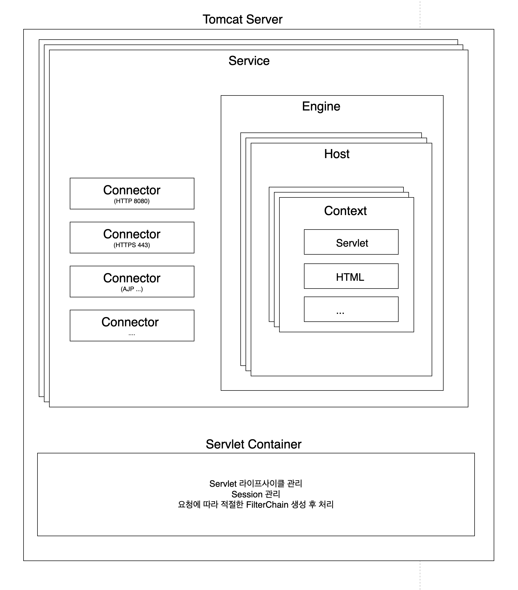

> [!question]
> - [ ] tomcat의 구조
> - [ ] Tomcat이 Java Servlet과 JSP를 관리한다는데 요즘은 JSP를 사용하지 않는데 이것까지 관리되는건가?
> - [x] apache와 tomcat의 관계
> - [ ] Spring Boot는 통합된 것일까, Tomcat 서버만 내장한 걸까? 그리고 이유는 뭐지?


## Apache와 Tomcat의 관계

> 오픈소스 소프트웨어 재단인 Apache Software Foundation(ASF)에 의해 개발된 프로젝트 중 하나가 Apache 웹 서버이다. ASF는 비영리 조직으로, 수많은 프로젝트를 호스팅하고 있다. 
> ASF는 `Apache`라는 이름을 가진 모든 프로젝트를 관리하며, 각 프로젝트는 독립적으로 운영 및 개발된다. 
> Apache Tomcat은 ASF의 프로젝트중 하나로 Java Servlet과 JSP를 실행하기 위한 오픈소스 서블릿 컨테이너이다. 
> 원래 Tomcat은 Sun Microsystems(현재 Oracle)이 Java Servlet과 JSP를 구현하기 위해 개발한 프로젝트였지만, 이후 기증되어 현재까지 ASF에서 유지 및 관리하고 있다. 

## Apache HTTP Server와 Apache Tomcat의 관계
1. Apache HTTP Server
	1. 웹 서버 소프트웨어로, 정적 콘텐츠를 제공하는데 사용된다. 세계에서 가장 널리 사용되는 웹서버 중 하나로, HTTP 및 HTTPS 프로토콜을 통해 클라이언트의 요청을 처리한다.
2. Apache Tomcat
	1. **서블릿 컨테이너** 또는 웹 애플리케이션 서버로서, Java 서블릿과 JSP를 실행하고 관리한다. Tomcat은 Java 기반의 웹 애플리케이션을 처리하는데 사용되며, Java EE 웹 애플리케이션의 개발, 테스트, 배포환경으로 많이 사용된다.

> Apache HTTP Server와 Apaceh Tomcat은 종종 통합하여 사용된다. 예를 들어, Apache HTTP Server는 정적 컨텐츠를 처리하고 Tomcat은 동적 컨텐츠(Java Servlet, JSP)를 처리하도록 설정할 수 있다.
> 통합하려면 AJP 또는 Http Reverse Proxy를 사용하여 이루어진다. Apache HTTP Server는 클라이언트 요청을 적절한 Tomcat 인스턴스로 전달할 수 있다.


> [!info] Apache Tomcat만 사용하는 경우
> 1. 단순한 Java 웹 애플리케이션인 경우
> 2. 개발 및 테스트환경
> 3. 소규모 또는 내부 애플리케이션


## Tomcat의 역할
1. 커넥터를 활용하여 HTTP 요청을 수신하여 요청에 대한 세부정보 분석: 자체적으로 Http 커넥터를 내장하고 있어 클라이언트의 HTTP 요청을 직접 받을 수 있다. HTTP 요청을 수신하여 서블릿 또는 JSP와 같은 동적 웹 콘텐츠를 처리한다.
2. 서블릿 컨테이너의 역할: Tomcat은 서블릿 컨테이너로서, Java 서블릿과 JSP 파일을 실행하는 기능을 갖추고 있다. HTTP 요청이 들어오면, Tomcat은 해당 요청을 `HttpServletRequest` 객체로 파싱하고, 이를 서블릿에 전달하여 비즈니스 로직을 처리한다.
3. 웹 애플리케이션 배포 및 실행: Tomcat은 `.war` 파일 형태로 패키징된 Java 웹 애플리케이션을 배포하고 실행할 수 있다. 


## Tomcat의 구조



### (1) Server
> Tomcat의 최상위 구성요소로, 전체 서버를 나타낸다. 하나의 Tomcat 인스턴스에는 하나의 Server 객체가 있으며, 이 Server는 여러 **Service** 객체를 포함할 수 있다.
> Server는 Tomcat의 시작과 종료를 제어하며, 전체 서버의 생명주기를 관리한다.

### (2) Service
> Server 내 중간 구성요소로, 하나 이상의 **Connector**를 하나의 **Engine**에 연결한다. Service는 클라리언트로부터 요청을 받고 이를 처리할 적절한 엔진으로 전달하는 역할을 한다. 각 Service는 여러 Connector를 가질 수 있지만, 단 하나의 Engine과 연결된다.

> [!info] Service가 여러개로 나누어지는 경우
> - 독립적인 구성 필요 
> 	- 만약 프로토콜이나 포트가 다른 보안설정, 로깅설정, 또는 다른 네트워크 설정을 필요로 하는 경우
> 	- 단일 Tomcat 인스턴스에서 여러 애플리케이션 환경을 분리하여 사용해야할 때도 여러개의 service를 사용할 수 있다. 예를 들어 하나의 서비스를 개발환경으로하고 하나의 서비스를 운영환경으로 하고 싶다면 분리할 수 있다.
> - 다른 엔진 설정: 만약 각 Service가 다른 엔진 설정을 필요로 하는 경우 (예: 서로 다른 웹 애플리케이션을 완전히 독립적으로 구동해야하는 경우)

> [!info] Tomcat에 요청이 들어왔을 경우 Connector 연결과정
> 1. 클라이언트가 HTTP 요청을 보내면, Tomcat 서버는 모든 Connector는 자신이 리스닝하고 있는 포트를 통해 들어오는 요청을 수신한다. 
> 2. 각 Connector는 자신이 처리할 수 있는 요청의 종류(프로토콜)과 포트를 정의하고 있다. 예를 들어, 하나의 Service에 HTTP와 HTTPS Connector가 모두 설정되어있는 경우, 각 Connector는 자신이 처리할 수 있는 프로토콜과 포트에 맞는 요청만 수신한다.
> 3. Connector가 포함되어 있는 Service의 Engine으로 요청 전달한다.

### (3) Connector
> 클라이언트와의 통신을 처리하는 구성요소이다.
> - **HTTP Connector**: HTTP or HTTPS 프로토콜을 통해 들어오는 요청을 수신하며, 주로 Tomcat이 독립적으로 웹 애플리케이션을 제공할 때 사용된다.
> - **AJP Connector**: Apache HTTP Server와 같은 다른 웹 서버와의 통합을 위해 사용된다. Apache HTTP Server에서 들어오는 요청을 AJP 프로토콜을 통해 Tomcat으로 전달할 수 있다.

> [!note] 
> Tomcat 내 Service가 여러 개로 나누어져 있고, 독립적으로 거성이 가능하지만 port와 protocol은 중복없이 유니크해야한다. 

### (4) Engine
> Tomcat의 요청 처리 파이프라인을 담당하는 구성요소로, Service 내에 존재한다. 
> Engine은 여러 **Host**를 포함할 수 있으며, 각 요청을 적절한 Host로 전달하고, 요청을 처리한 후 응답을 다시 Connector로 보낸다.

> [!tip] 여러개의 호스트중에 어떤 식으로 선택되는지
> Tomcat은 Host 헤더가 일치하는 Host로 요청을 전달한다. 
> > [!example]
> > ```xml
> > `<Engine name="Catalina" defaultHost="www.example.com">
> > 	`<Host name="www.example.com" appBase"webapps1">
> > 		`<Context path="" docBase="ROOT" reloadable="true" />
> > 		`<Context path="/shop" docBase="shop" reloadable="true" />
> > 	`</Host>
> > `</Engine>
> > ```
> > `http://www.example.com/shop`로 요청이 오면 `www.example.com`을 가진 Host로 요청을 전달한다. 그리고 요청의 URL 경로가 `/shop`이므로, `/shop`으로 매핑된 Context에서 처리된다.

> [!tip] 여러 호스트를 하나의 IP에서 처리하는 이유
> 같은 브랜드에서 여러 서비스를 나누고 싶을 수도 있다. 예를 들어 `exmaple`이라는 브랜드라면 `shop.example.com`, `support.example.com`, `blog.example.com`이라는 서비스를 나누어놓고, 같은 서버자원을 사용하여 비용을 절감하고 싶다면 사용할 수 있을 것 같다. 

### (5) Host
> 특정 도메인 네임(EX: `www.example.com`)과 연관된 가상 호스트를 나타내며, 하나의 Engine 내에서 여러 Host를 정의할 수 있다. 각 Host는 하나이상의 **Context**를 포함할 수 있다.

> [!question] 요청기반으로 분기처리되는 것 같은데 왜 Connector가 아닌 Engine에 포함될까? 
> 우선 Connector는 네트워크 계층에서 작업을 처리한다. 
> Engine은 하나의 Service 내에서 요청의 라우팅을 관리하는 역할을 한다. Connector가 요청을 Service에 전달하면, Engine은 도메인 이름 기반의 호스팅 설정을 통해 적절한 Host를 선택하고, 각 Host의 Context 설정에 따라 Context 설정에 따라 최종적으로 요청을 라우팅한다. 
> 즉, 요청을 프로토콜과 포트에 따라 리스닝하고 있는 역할을 Connector가 하고, 받아서 전달할 때 어느 애플리케이션에 라우팅할지 선택하는 건 Engine이 한다. 그렇게 함으로써 웹서버가 여러 도메인을 손쉽게 관리할 수 있다.

### (6) Context
> 특정 웹 애플리케이션을 나타내는 구성요소이다. 각 Host는 여러 Context를 가질 수 있으며, Context는 웹 애플리케이션의 루트와 경로를 정의한다.
> Context는 서블릿, JSP, 정적파일, 웹 애플리케이션 설정 등을 포함하며, 각 애플리케이션이 독립적으로 동작하도록 관리한다.

```xml ```

> [!info] 주요설정 요소
> > [!example]
> > ```xml 
> > `<Context path="/shop" docBase="shop" reloadable="true">
> > ```
> - path: Context가 제공하는 웹 애플리케이션 URL 경로 정의. 따라서 예에서 설정으로 보았을때 `/shop` 경로로 들어오는 모든 요청을 처리하는 애플리케이션을 의미한다.
> - docBase: 웹 애플리케이션의 실제 위치를 지정한다. 이는 애플리케이션의 루트 디렉토리를 가리키며 docBase가 설정된 디렉토리 내의 모든 파일이 해당 웹 애플리케이션의 일부로 간주된다.
> - reloadable: 속성이 `true`로 설정된 경우, Tomcat 애플리케이션의 클래스 팡리이나 리소스 파일의 변경을 감지하고 자동으로 애플리케이션을 다시 로드할 수 있다.

### (7) Servlet Container (Catalina)
> Tomcat의 핵심 부분으로, Java 서블릿과 JSP를 실행하고 관리하는 역할을 한다. Catalina는 서블릿 스펙을 구현하며, 모든 HTTP 요청을 서블릿으로 매핑하여 처리한다.
> 서블릿 컨테이너는 서블릿의 수명 주기 관리(초기화, 서비스, 종료)를 담당하고, 동적 웹 컨텐츠를 생성하여 클라이언트에 반환한다.


---

> [!note] 참고링크
> - https://tomcat.apache.org/tomcat-9.0-doc/architecture/overview.html


